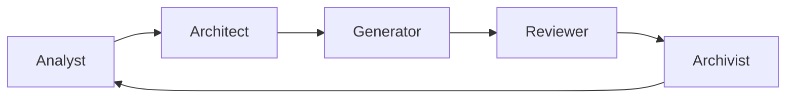

# PDD Map

Diese Datei ist die Landkarte des Repositories.

Sie erklärt auf einen Blick:
- was dieses Projekt ist
- welche Artefakte es gibt
- wie sie zusammenhängen
- wie daraus ein Endprodukt entsteht

Wenn du neu im Repo bist: starte hier.

---

# 1 Nordstern

Dieses Repository ist ein **docs-first Labor** für Prompt Driven Development (PDD).

Es ist nicht primär ein Code-Projekt.
Es ist ein Projekt, das zeigt:

- wie Entscheidungen entstehen
- wie KI als Werkzeug eingebunden wird
- wie Code als Folge dokumentierter Schritte entsteht
- wie daraus ein veröffentlichbares Endprodukt wird (statische Website)

---

# 2 Artefakte (die Bausteine)

| Artefakt          | Ort                                | Zweck                                                  |
|-------------------|------------------------------------|--------------------------------------------------------|
| Project Intent    | `/meta/project-intent.md`          | Was ist das Projekt? Warum existiert es?               |
| Workflow          | `/meta/workflow.md`                | Regeln und Betriebsanleitung                           |
| PDD Loop          | `/meta/pdd-loop.md`                | kleinster reproduzierbarer Zyklus                      |
| Agent Contract    | `/meta/agent-contract.md`          | Regeln für KI-Agenten                                  |
| Agent Roles       | `/meta/agent-roles.md`             | Arbeitsmodi für KI/Team                                |
| Startup Checklist | `/meta/agent-startup-checklist.md` | Boot-Sequenz für Agenten                               |
| Worklog           | `/worklog/`                        | Chronologie: was ist passiert, warum, was als nächstes |
| Decisions (ADR)   | `/decisions/`                      | Trade-offs als Kanon: was gilt                         |
| Prompts           | `/prompts/`                        | versionierte KI-Eingaben                               |
| Content           | `/docs/`                           | Kapitel, Texte, Inhalte                                |
| Build/Tools       | `/scripts/`                        | Pipeline: Markdown → HTML                              |
| Templates         | `/templates/`                      | HTML Layout / Page Skeleton                            |

---

# 3 das System in einem Satz

**PDD bedeutet hier:**
Wir übersetzen Intent in nachvollziehbare Artefakte.
Und wir lassen keine Änderung ohne Spur zurück.

---

# 4 Ablauf einer Änderung (Change Lifecycle)

```mermaid
flowchart TD
  A[Intent / Idee] --> B[Context prüfen]
  B --> C{Trade-offs?}
  C -->|Ja| D[ADR in /decisions]
  C -->|Nein| E[weiter]
  D --> E[Plan klein, 1 - 2h]
  E --> F[Prompt archivieren /prompts]
  F --> G[Build / Implementation]
  G --> H[Review / Quality Gate]
  H --> I[Worklog update /worklog]
  I --> J[Next step]
  J --> A
````

---

# 5 Artefakt-Fluss (wo landet was?)

```mermaid
flowchart LR
  Intent --> Worklog
  Context --> Worklog

  Plan --> Prompts
  Prompts --> Build

  Build --> Docs[docs]
  Build --> Code[scripts templates]

  Review --> Worklog
  Review --> Decisions

  Decisions --> Build
  Decisions --> Docs

  Worklog --> Next[Next]
  Next --> Intent
```

---

# 6 Rollen (wer macht was?)

Rollen sind Arbeitsmodi.
Ein Agent arbeitet immer in genau einer Rolle.



* **Analyst**: erklärt Zustand, Risiken, Zusammenhänge
* **Architect**: bereitet Entscheidungen vor (ADRs)
* **Generator**: implementiert kleine Schritte
* **Reviewer**: prüft Qualität, KISS/YAGNI, Alignment
* **Archivist**: pflegt Worklog, Prompts, Verweise

---

# 7 Build Map (Markdown → Endprodukt)

Das Endprodukt ist eine **statische Website**.

Minimaler Pfad:

```
/docs/*.md  →  build script  →  /site/*.html  →  GitHub Pages
```

Ziel:

* simpel
* reproduzierbar
* keine schweren Frameworks

Der Build ist ein Werkzeug, nicht der Kern.
Der Kern bleibt die Meta-Ebene und der dokumentierte Prozess.

---

# 8 Regeln (kurz)

* Keine strukturelle Änderung ohne Worklog
* Trade-offs → ADR
* Prompts werden archiviert
* Kleine Iterationen (1–2h)
* KISS / YAGNI

---

# 9 Wie man in dieses Repo einsteigt

## Für Menschen

1. `/meta/project-intent.md`
2. `/meta/pdd-map.md` (diese Datei)
3. `/meta/workflow.md`
4. letzter Worklog Eintrag
5. letzte Decisions

## Für KI-Agenten

1. `/meta/agent-startup-checklist.md`
2. Rolle wählen (Analyst / Architect / Generator / Reviewer / Archivist)
3. erst analysieren, dann planen, dann bauen

---

# 10 Ende

Wenn das Repo gut funktioniert, kann jemand es lesen und verstehen:

* warum etwas gebaut wurde
* wie es gebaut wurde
* welche Entscheidungen getroffen wurden
* und wie man es reproduzieren kann

Nicht nur das Ergebnis zählt.
Der Weg ist Teil des Produkts.