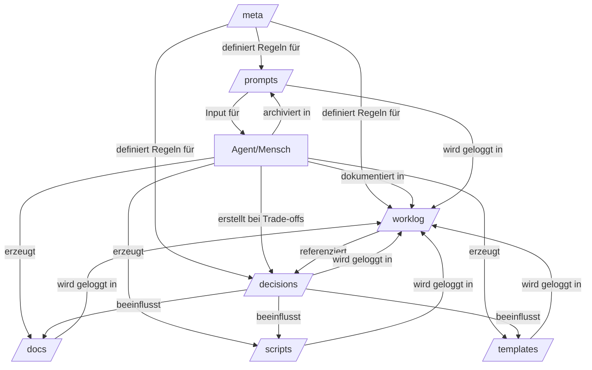

# Worklog 2026-03-04_002 — Repository Mental Model

## Context

Zweiter Alignment-Prompt ausgeführt.
Aufgabe: Mentales Modell des Repositories aufbauen.

Ziel: Verstehen, wie die Verzeichnisse interagieren und welche Artefakte Inputs, Outputs und Decisions repräsentieren.

## Decision

Systemanalyse durchgeführt.
Keine Implementierung.

Repository-Struktur und Lifecycle analysiert.

## Why

Gemäß Agent-Startup-Checklist Step 2:
- Repository-Struktur analysieren
- Rolle jedes Bereichs verstehen
- Erkennen: welche Artefakte existieren, fehlen, aktualisiert werden müssen

## Result

### 1. Verzeichnis-Interaktionen



#### `/meta/` — Systemkonstitution
- **Rolle**: Definiert die Spielregeln
- **Inhalt**: project-intent.md, workflow.md, pdd-loop.md, agent-startup-checklist.md
- **Natur**: Quasi-unveränderlich (nur bei fundamentalen Änderungen)
- **Interaktion**: Wird von allen anderen Verzeichnissen referenziert, aber selbst ändert sich selten

#### `/worklog/` — Chronologisches Gedächtnis
- **Rolle**: Zeitstrahl aller Aktivitäten
- **Inhalt**: Tägliche Einträge (YYYY-MM-DD.md, YYYY-MM-DD_NNN_topic.md)
- **Natur**: Nur Append, nie Delete
- **Interaktion**: 
  - Empfängt Updates aus allen anderen Bereichen
  - Referenziert Decisions und Prompts
  - Ist das "Log" im PDD Loop

#### `/decisions/` — Architektonischer Kanon
- **Rolle**: Trade-offs und dauerhafte Entscheidungen
- **Inhalt**: ADRs (Architecture Decision Records)
- **Natur**: Statusbasiert (proposed → accepted → superseded → deprecated)
- **Interaktion**:
  - Wird erstellt wenn Trade-offs existieren
  - Wird im Worklog geloggt
  - Beeinflusst Code/Docs/Scripts/Templates
  - Ist das "Decide" im PDD Loop

#### `/prompts/` — Input-Artefakte
- **Rolle**: Versionierte Eingaben an KI-Systeme
- **Inhalt**: Prompts mit Dateiname YYYY-MM-DD_NNN_topic.md
- **Natur**: Unveränderlich nach Erstellung (versioniert)
- **Interaktion**:
  - Input für Build-Phase
  - Wird im Worklog geloggt
  - Dokumentiert Annahmen und erwartete Ergebnisse
  - Ist Teil von "Plan" im PDD Loop

#### `/docs/` — Inhaltliche Outputs
- **Rolle**: Dokumentation und publizierbare Inhalte
- **Inhalt**: Markdown-Texte für statische Website
- **Natur**: Änderbar, aber mit Trace
- **Interaktion**:
  - Output der Build-Phase
  - Folgt aus Decisions
  - Wird im Worklog dokumentiert

#### `/scripts/` — Ausführbare Outputs
- **Rolle**: Werkzeuge und Automatisierung
- **Inhalt**: Build-Scripts, Helpers, Utilities
- **Natur**: Änderbar, aber mit Trace
- **Interaktion**:
  - Output der Build-Phase
  - Folgt aus Decisions (z.B. "wie wird Markdown zu HTML?")
  - Wird im Worklog dokumentiert

#### `/templates/` — Strukturelle Outputs
- **Rolle**: Wiederverwendbare Muster
- **Inhalt**: Vorlagen für Dokumente, Strukturen
- **Natur**: Änderbar, aber mit Trace
- **Interaktion**:
  - Output der Build-Phase
  - Folgt aus Decisions (z.B. "wie sieht eine ADR aus?")
  - Wird im Worklog dokumentiert

---

### 2. Artefakt-Klassifikation

#### Inputs (Was geht rein)
- `/prompts/` — Aufgaben an KI-Systeme
- `/meta/` — Systemregeln (externe Definition durch Menschen)
- Menschliche Entscheidungen (manifestiert in Decisions)

#### Outputs (Was kommt raus)
- `/docs/` — Dokumentation
- `/scripts/` — Code
- `/templates/` — Strukturen
- `/worklog/` — Protokoll (sekundärer Output)

#### Decisions (Was wird entschieden)
- `/decisions/` — ADRs mit Trade-offs
- `/worklog/` — Kleinere Entscheidungen ohne Trade-offs

#### Traces (Was wird protokolliert)
- `/worklog/` — Chronologie aller Änderungen
- Git Commits — Technische Änderungshistorie

---

### 3. Lifecycle einer Änderung

```
┌─────────────────────────────────────────────────────────────┐
│                    PDD Loop Lifecycle                        │
└─────────────────────────────────────────────────────────────┘

1. INTENT (Idee)
   ↓
   Manifestiert in: Worklog (Context)
   Frage: "Was soll am Ende anders sein?"

2. CONTEXT (Aktueller Stand)
   ↓
   Lesen: /meta/, /worklog/, /decisions/
   Frage: "Was ist der aktuelle Stand? Welche Constraints?"

3. PLAN (Aufgabe formulieren)
   ↓
   Manifestiert in: /prompts/ (wenn KI involviert)
   Frage: "Was ist der konkrete nächste Schritt (1-2h)?"

4. BUILD (Implementierung)
   ↓
   Erzeugt/Ändert: /docs/, /scripts/, /templates/
   Frage: "Minimal, boring, reproduzierbar?"

5. REVIEW (Quality Gate)
   ↓
   Prüfung: Passt zum Intent? KISS/YAGNI? Verständlich?
   Frage: "Braucht es eine Decision (Trade-offs)?"

6. DECIDE (Verbindlich machen)
   ↓
   Wenn Trade-offs: Erstelle ADR in /decisions/
   Wenn keine Trade-offs: Direkt zu Log
   Frage: "Akzeptieren, Verwerfen, Ersetzen, Proposed?"

7. LOG (Dokumentieren)
   ↓
   Immer: Update /worklog/
   Optional: Update /decisions/ (wenn ADR)
   Optional: Archiviere /prompts/ (wenn KI involviert)
   Frage: "Ist der Prozess nachvollziehbar?"

8. REPEAT (Nächster Zyklus)
   ↓
   Zurück zu Intent mit neuem, kleinem Schritt
```

---

### 4. Beispiel-Lifecycle (konkret)

**Szenario**: "Wir brauchen einen Build-Prozess für Markdown → HTML"

1. **Intent**: "Build-System implementieren"
   - **Worklog**: Neuer Eintrag mit Context

2. **Context**: 
   - Lese `/meta/project-intent.md` → "Minimaler Ansatz, keine schweren Frameworks"
   - Lese `/decisions/` → Prüfe, ob bereits Build-Entscheidungen existieren
   - Lese `/worklog/` → Was wurde zuletzt gemacht?

3. **Plan**: 
   - Erstelle `/prompts/2026-03-04_003_build-system.md`
   - Inhalt: "Implementiere minimales Python-Script für Markdown zu HTML"
   - Erwartung: Ein Script, das `/docs/` → `/output/` transformiert

4. **Build**:
   - Erstelle `/scripts/build.py`
   - Implementierung: Minimal mit `markdown` library

5. **Review**:
   - Passt zu "minimal technischer Ansatz"? ✅
   - KISS/YAGNI verletzt? Nein ✅
   - Trade-offs? Ja: "Python vs. andere Tools"

6. **Decide**:
   - Erstelle `/decisions/0003-python-build-system.md`
   - Status: accepted
   - Begründung: Bereits Python im Projekt, KISS-Prinzip

7. **Log**:
   - Update `/worklog/2026-03-04.md`
   - Referenz zu Decision und Prompt
   - Result: Build-Script funktioniert
   - Next: Testing mit echten Docs

8. **Repeat**:
   - Nächster Intent: "Build-Script testen mit echten Markdown-Dateien"

---

### 5. Kritische Abhängigkeiten

```
/meta/ muss stabil sein
  ↓
  Sonst: Chaos, da andere Bereiche sich auf Regeln verlassen

/worklog/ darf nie gelöscht werden
  ↓
  Sonst: Nachvollziehbarkeit verloren

/decisions/ muss konsistent bleiben
  ↓
  Sonst: Widersprüchliche Architektur

/prompts/ darf nicht geändert werden
  ↓
  Sonst: Versionierung kaputt
```

---

### 6. Mentales Modell — Metapher

Das Repository ist wie ein **Forschungslabor**:

- `/meta/` = Laborordnung (Sicherheitsregeln, Ethikrichtlinien)
- `/worklog/` = Laborbuch (chronologisch, ehrlich, vollständig)
- `/decisions/` = Veröffentlichte Papers (peer-reviewed, dauerhaft)
- `/prompts/` = Experimentierprotokolle (was wurde getestet?)
- `/docs/` = Lehrbuch (was erklären wir der Welt?)
- `/scripts/` = Laborgeräte (Werkzeuge, die wir gebaut haben)
- `/templates/` = Standardverfahren (SOPs)

Der PDD Loop ist der **wissenschaftliche Prozess**:
- Hypothese (Intent)
- Recherche (Context)
- Versuchsplan (Plan)
- Experiment (Build)
- Peer Review (Review)
- Publikation (Decide)
- Laborbuch-Eintrag (Log)
- Nächste Hypothese (Repeat)

---

## Next

Mental model ist vollständig.

Bereit für:
- Aufgaben, die das Repository verändern
- Entscheidungen gemäß dem Loop treffen
- Artefakte korrekt einordnen

Agent versteht jetzt:
- Wo was hingehört
- Was Input, Output, Decision ist
- Wie der Lifecycle funktioniert
- Warum Nachvollziehbarkeit zentral ist

---

**Agent**: GitHub Copilot
**Datum**: 2026-03-04
**Phase**: Alignment — Mental Model
**Prompt**: `prompts/alignment/2026-03-04_001_repo-model.md`